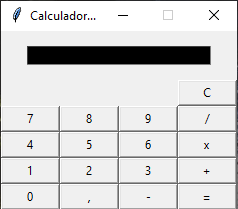

### Calculadora simple

### Requisitos 
- Python 
- Libreria Tkinter
 
### Descripción
- Una calculadora programada en python con operaciones basicas; suma, resta, multiplicación y división  
Puede operar para números enteros y decimales. No esta definida la division por cero.
